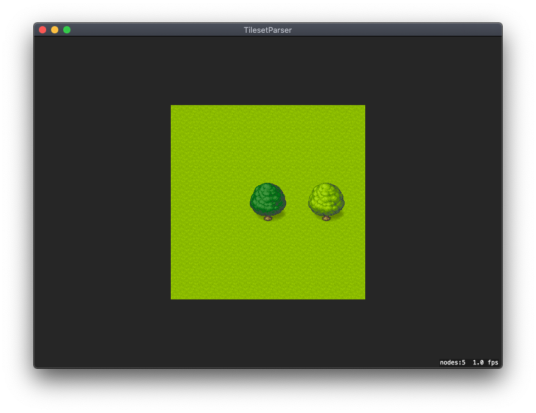

# TiledSwift

A framework to import tile map from Tiled into your swift project.

## Installation
### Swift Package Manager

TiledSwift use Swift Package manager. To integrate it in your project, add the following as a dependency to your `Package.swift`:
```swift
.package(url: "https://github.com/bpisano/TiledSwift.git", .upToNextMajor(from: "0.0.3"))
```
and then specify "TiledSwift" as a dependency of the Target in which you wish to use TiledSwift.

## Usage

With TiledSwift, you can import your Tiled maps, into your Swift project easily. TiledSwift supports Tiled maps with multiple tilset, multiple layers and also object groups. For example, the following map can be integrated in your project with TiledSwift:



To do so, follow the instructions.

### 1. Import your .tmx map in your Xcode project.
First, verify that your tilesets in your Tiled map are embedded in the map. TiledSwift will use the name of the images in the path to properly fetch the tilesets.
Then, export your map in Tiled using xml format, and drag and drop it in your Xcode project.
Finally, put your tilesets into your `Asset.xcasset` with the same name you used in Tiled.

### 2. Parse the map
You can parse the imported map by using the following code:
```swift
do {
    try TileMapParser(fileNamed: "MyMap").parseMap { parsedTileMap in
        // Your parsed tile map here.
    }
} catch {
    print(error.localizedDescription)
}
```

### 3. Display the map
Your parsed map can be easily displayed in a `SKScene` using a `TileMapNode`.
```swift
let tileMapNode = TileMapNode(tileMap: parsedTileMap)
addChild(tileMapNode)
```

### 4. Configuring the map
You can access different property in a `TileMapNode` to customize it the way you want.
```swift
tileMapNode.layer(named: "Ground") // Return the layer "Ground" where you can access the SKTileMap generated.
tileMapNode.objectGroup(named: "Collisions") // Return the object groups "Collisions" where you can access the SKSpriteNode generated.
```

You can even directly apply `SKPhysicsBody` on all the objects in a group to create collisons.
```swift
tileMapNode.setPhysicsBody(myPhysicsBody, toObjectsInGroupNamed: "Collisions") // Apply a SKPhysicsBody to all the objects in the group "Collisions".
```

## Features
- [x] Supports xml.
- [x] Supports layers.
- [x] Supports object groups.
- [x] Supports multiple tilesets.
